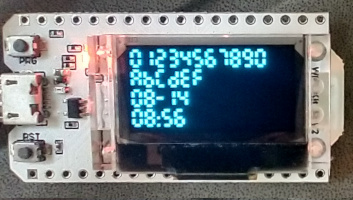
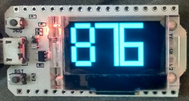
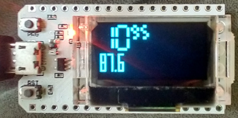
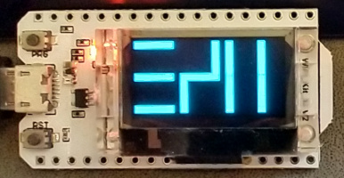

# oled7segment.py

A lightweight 7 segment character generator that allows cutomizable sizing to fit small OLED displays.

### Sample Code

##### Hardware:

All of these tests were run on a HiLetgo ESP32 OLED WiFi Kit ESP-32
using a Thonny editor on a Raspberry 400.

##### Set up:

Used with all examples:
```python
import sys
import machine
from machine import Pin, SoftI2C
import ssd1306
import gfx
import utime as time

from oled7segment import *

i2c = SoftI2C(scl=Pin(15), sda=Pin(4))

pin = Pin(16, Pin.OUT)
pin.value(0) #set GPIO16 low to reset OLED
pin.value(1) #while OLED is running, must set GPIO16 in high

oled_width = 128
oled_height = 64
oled = ssd1306.SSD1306_I2C(oled_width, oled_height, i2c)

graphic = gfx.GFX (oled_width, oled_height, oled.pixel)

seven_segment = OLED7Segment (graphic)

d_t = time.localtime ()
date_str = '{:02d}-{:02d}'.format (d_t[1], d_t[2])
time_str = '{:02d}:{:02d}'.format (d_t[3], d_t[4])
```

##### Small segments
```python
xpos = 0
ypos = 0
seven_segment.set_parameters (digit_size="S", spacing=2)
oled.fill (0)
seven_segment.display_string (xpos, ypos, "01234567890")
ypos += seven_segment.get_character_height ()   
seven_segment.display_string (xpos, ypos, "ABCDEF")
ypos += seven_segment.get_character_height ()
seven_segment.display_string (xpos, ypos, date_str)
ypos += seven_segment.get_character_height ()
seven_segment.display_string (xpos, ypos, time_str)
ypos += seven_segment.get_character_height ()
oled.show ()
```
 From code above
```
Line 1: digits only
Line 2: hexidecimal characters
Line 3: Date with dash (minus sign)
Line 4: Time with colon
```
##### Large segments
```python
xpos = 0
ypos = 0
seven_segment.set_parameters (digit_size="L")
oled.fill (0)
xpos += seven_segment.display_string (xpos, ypos, "8")
seven_segment.set_parameters (bold=True)
seven_segment.display_string (xpos, ypos, "76")
oled.show ()
```
 From code above
```
1st character, Bold=False
2nd, 3rd characters, Bold=True
```
##### Custom segment sizes
```python
xpos = 0
ypos = 0
oled.fill (0)
seven_segment.set_parameters (digit_size="M", spacing=2)
char_height = seven_segment.get_character_height () # save tallest seg
xpos += seven_segment.display_string (xpos, ypos, "10")
seven_segment.set_parameters (v_segment_length=4, h_segment_length=4)
seven_segment.display_string (xpos, ypos, "95")

xpos = 0
ypos += char_height + 2 # plus extra spacing
seven_segment.set_parameters (bold=True,
                                spacing=2,
                                segment_width=2,
                                v_segment_length=8,
                                h_segment_length=3)
seven_segment.display_string (xpos, ypos, "87.6")
oled.show ()
```
 From code above
```
line 1: Changes the segment lengths
Line 2: Tall, narrow segment, usefull for displaying a lot of digits
```

##### Custom segments
```python
xpos = 0
ypos = 0
seven_segment.set_parameters (digit_size="L",bold=True)
oled.fill (0)
seven_segment.TOP_seg (xpos, ypos)
seven_segment.MID_seg (xpos, ypos)
seven_segment.BOT_seg (xpos, ypos)
xpos += 40
seven_segment.UR_seg (xpos, ypos)
seven_segment.MID_seg (xpos, ypos)
seven_segment.LL_seg (xpos, ypos)
xpos += 40
seven_segment.UR_seg (xpos, ypos)
seven_segment.UL_seg (xpos, ypos)
seven_segment.LR_seg (xpos, ypos)
seven_segment.LL_seg (xpos, ypos)
oled.show ()
```
 From code above
```
You can create custom symbols (Klingon?) by calling the individual segment functions.
Segment positioning is manual.
```

##### Busy/Waiting indicator
```python
xpos = 0
ypos = 0
seven_segment.set_parameters (digit_size="S",bold=False)
oled.fill (0)
for i in range (0, 10) :             # repeat 10 times
    for iteration in range (1, 5) :  # 4 different iterations
        if iteration == 1 :
            seven_segment.UL_seg (xpos, ypos, 0)
            seven_segment.TOP_seg (xpos, ypos)
            seven_segment.UR_seg (xpos, ypos)
        elif iteration == 2 :
            seven_segment.TOP_seg (xpos, ypos, 0)
            seven_segment.UR_seg (xpos, ypos)
            seven_segment.MID_seg (xpos, ypos)
        elif iteration == 3 :
            seven_segment.UR_seg (xpos, ypos, 0)
            seven_segment.MID_seg (xpos, ypos)
            seven_segment.UL_seg (xpos, ypos)
        elif iteration == 4 :
            seven_segment.MID_seg (xpos, ypos, 0)
            seven_segment.UL_seg (xpos, ypos)
            seven_segment.TOP_seg (xpos, ypos)
        oled.show ()
        time.sleep (0.1)
seven_segment.TOP_seg (xpos, ypos)      # done
seven_segment.UR_seg (xpos, ypos)
seven_segment.MID_seg (xpos, ypos)
seven_segment.UL_seg (xpos, ypos)
oled.show ()
```
Couldn't provide a video. The segments rotate 10 times
```
Shows that something is happening
```
